# DevDay Lab: Build and Run a Containerized Web Application using Docker and Amazon Elastic Container Service (ECS)

In this lab we will learn how to build and run a containerised application. We will then use the Amazon Elastic Container Service to host and run this container in the Cloud.

The diagram below illustrates the architecture the lab will be using. There is currently a version of this architecture deployed for you in the cloud. In this lab we will be deploying a new version of our containerized application onto this cluster.

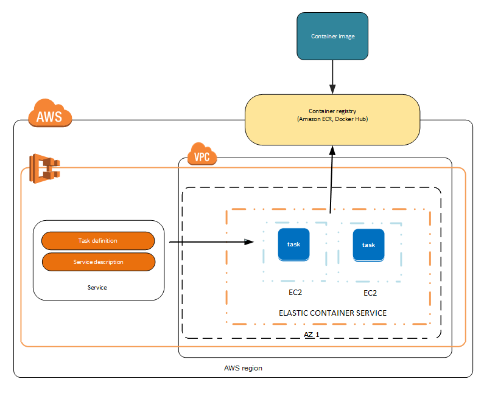

## Let's get started


Go to **Cloud9** on the AWS Web console - this is your IDE in the cloud.
You can also use your local IDE for all the steps of this lab.

* on top right corner - **Switch to Oregon**

* on the left hand pane click on **"Shared With You"**

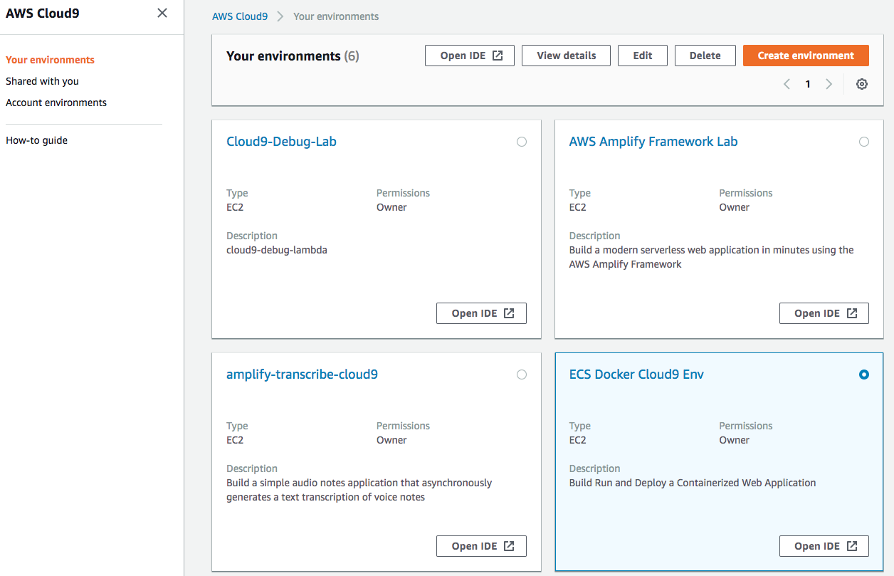

Open the "**ECS Lab Cloud 9 Env**" By clicking on **Open IDE**

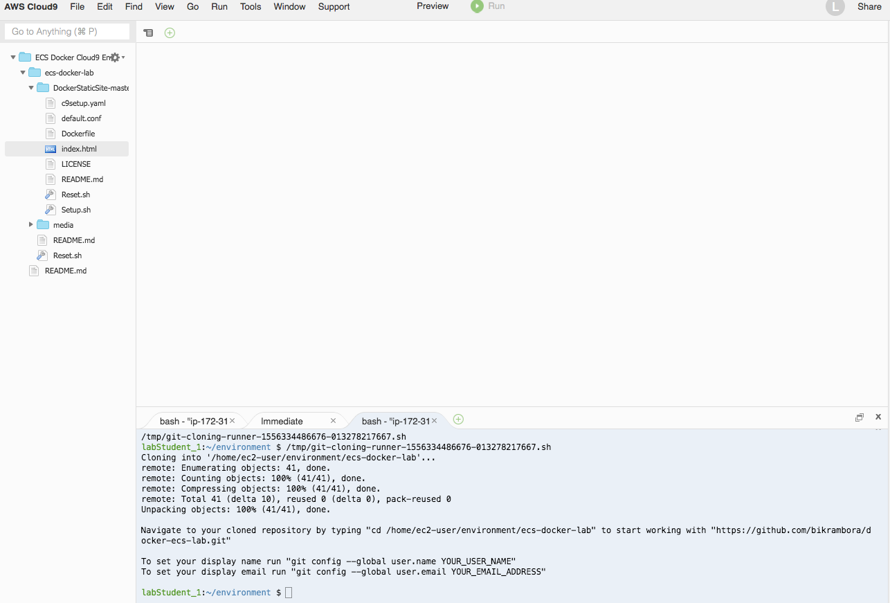

## Initial set up

Once Inside Cloud9 - Open the Terminal change directory to the correct folder & **reset the lab**

```
$ cd ~/environment/devlabs2018/

$ chmod +x Reset.sh

$ ./Reset.sh

$ clear

```

Install and run docker
```
$ sudo yum update -y

$ sudo yum install -y docker

$ sudo service docker start

$ sudo usermod -a -G docker ec2-user
```

Check if docker is installed and running corectly

```
$ docker info
```

Open the **index.html** file inside the Dev Labs folder and edit the **Write something here**

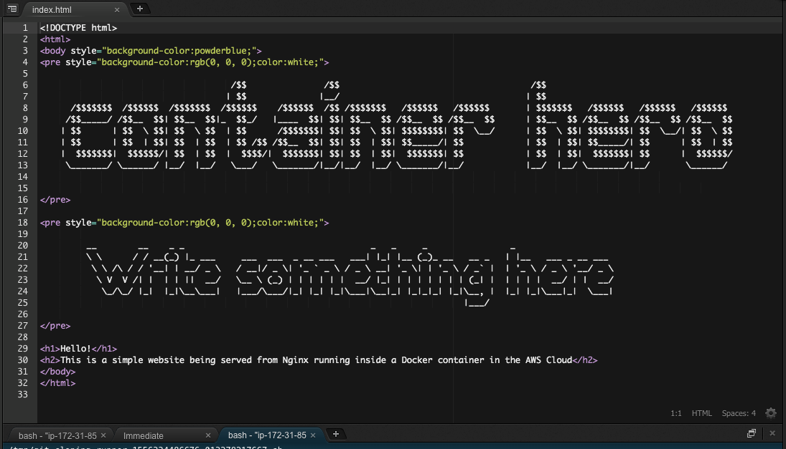

The next person will read what you put in so please be respectful

* **Save** your edited HTML File

## Build and Run your Docker Container Locally

Build a container Image from the DockerFile
```
$ docker build -t staticsite:1.0 DockerStaticSite-master/
```

Run a container from the freshly built image
```
$ docker run -itd \--name mycontainer \--publish 8080:80 staticsite:1.0
```
Test if your container is running
```
$ curl http://localhost:8080
```

**If you get an HTML page as a response, then the container is running successfully - well done!.**

## Push your container Image to the Cloud

Now that your containerized application is running locally, let's push
your docker image to a ECR (Elastic Container Repository) repository in
the cloud

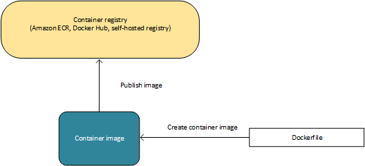

Navigate to the ECS (Elastic Container Service) console and click on
**Repositories**

Click on "**ecs-lab-repo**"

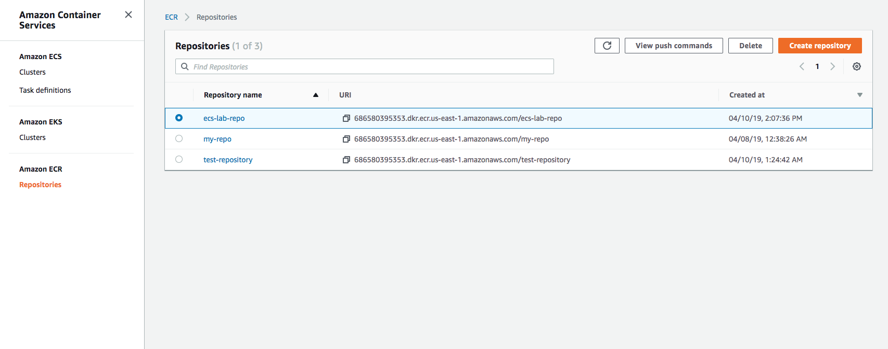

Click on "**View Push Commands** "

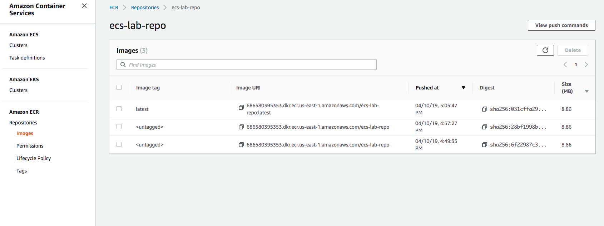

You will see a set of commands

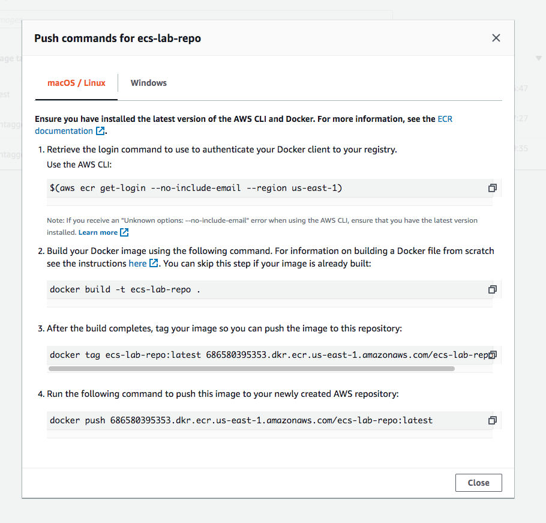

**Go back to cloud9 cd into the correct folder**
```
$ cd DockerStaticSite-master/
```
Login to ECR using (The quotes in the command are important)
```
$ `aws ecr get-login --no-include-email --region us-west-2`
```

**Follow the steps 3, 4 & 5 of the push commands to build and push the modified image**

\*If facing issues - make sure you've done step 2

**Once the push is completed your docker image will be pushed to an ECR image repository on AWS**

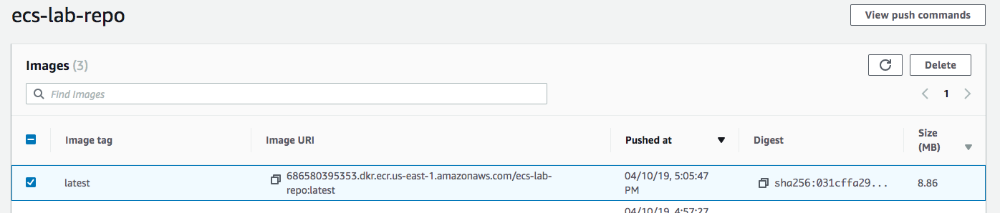

## Update the cluster to use our new pushed image


An ECS cluster is already provisioned for you. This cluster is
currently running a previous version of the same application. You will
now **Deploy** the your new application **Version** to the service

## Let's update the ECS task definition to use the image that you just pushed

Navigate to the **Elastic Container Service** Dashboard.

In the navigation menu on the **left**, click **Task Definitions.**

* select the **simplewebtask**

* checkmark **simplewebtask**

* click **Create New Revision**

* scroll to the bottom of the page, then click **Create**

This will create a new version of the Task. Note the Version Number. The
new version will use the latest container image. i.e. the image that you
just pushed.

## Let's Update the ECS Service to deploy the new version of the task

* in the left navigation pane, click **Clusters**.

* in the **Clusters** window, click **default \>**.

This is the cluster that your service resides in.

* on the **Services** tab, check **webService**

* click **Update** then click on **Revision**

* **Revision:** select the *latest version that you just created*

* **Force New Deployment --** check this box & turn it on

* click **Next Step**

* on **Step 2**, click **Next Step**

* on **Step 3**, click **Next Step**

* on **Step 4**, click **Update Service**

This will deploy a new version of the application.

* on the **Launch Status** page, click **View Service**

* on the **Service: myService** page, click the **Events** tab.

## Check if the new version on the application has successfully deployed

Wait a few minutes. Monitor the process of draining connections and
stopping tasks till the service reaches a steady state.

You may need to click the **Refresh** button to see the new events.

Once the events says "service webService has reached a steady state."

* Go to EC2 service page 

* On the left hand pane click on load balancers

* search and click on **myLoadBalancer**

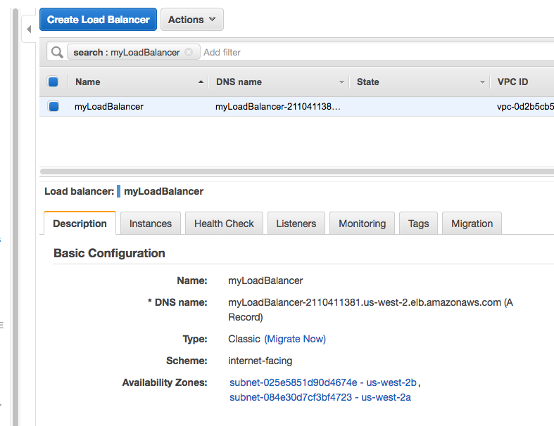

* Paste in the **Load Balancer\'s DNS name** to see the new version of the
app running in the cloud

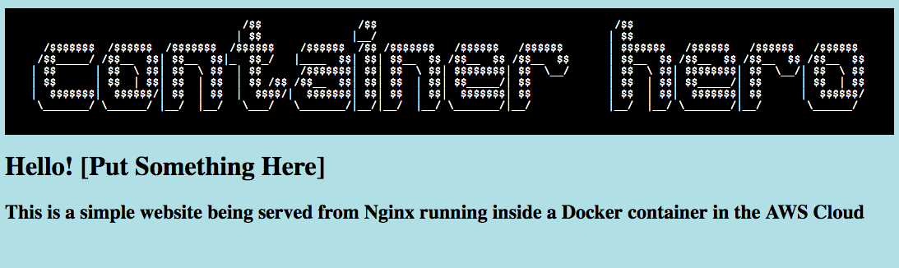

Congratulations! Your Containerized web application is Now Running in
the cloud


## Clean Up Step

```
$ chmod +x Reset.sh

$ ./Reset.sh
```


## Further reading

https://docs.aws.amazon.com/AmazonECS/latest/developerguide/docker-basics.html

https://docs.aws.amazon.com/AmazonECS/latest/developerguide/Welcome.html

https://docs.aws.amazon.com/AmazonECS/latest/developerguide/AWS_Fargate.html

